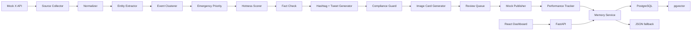

# Architecture

```mermaid
flowchart LR
  A["Mock X API"] --> B["Source Collector"]
  B --> C["Normalizer"]
  C --> D["Entity Extractor"]
  D --> E["Event Clusterer"]
  E --> F["Emergency Priority"]
  F --> G["Hotness Scorer"]
  G --> H["Fact Check"]
  H --> I["Hashtag + Tweet Generator"]
  I --> J["Compliance Guard"]
  J --> K["Image Card Generator"]
  K --> L["Review Queue"]
  L --> M["Mock Publisher"]
  M --> N["Performance Tracker"]
  N --> O["Memory Service"]
  O --> P["PostgreSQL"]
  P --> Q["pgvector"]
  O --> R["JSON fallback"]
  S["React Dashboard"] --> T["FastAPI"]
  T --> O
```
